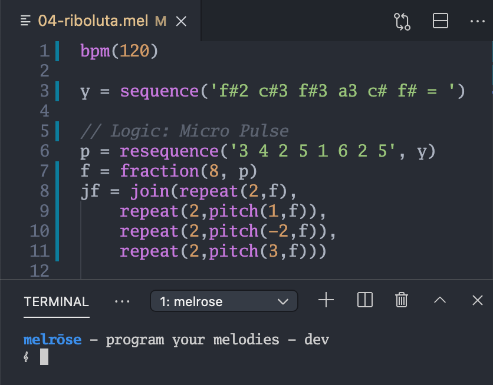

# Melrōse - programming of music melodies

[](https://github.com/emicklei/melrose/actions)
[](https://goreportcard.com/report/github.com/emicklei/melrose)
[](https://pkg.go.dev/github.com/emicklei/melrose?tab=doc)


## Introduction

`melrōse` is a tool to create and play music by programming melodies.
It uses a custom language to compose notes and create loops and tracks to play.
This is an example of a simple major scale C.

```javascript
sequence('c d e f g a b c5')
```

Note sequences in your program can be changed while playing giving you direct audible feedback. 
For the best experience, use the `melrōse` tool together with the Visual Studio Code Plugin for Melrōse.

See also [Blog post](http://ernestmicklei.com/melrose/introduction_melrose/)

## Install

See [Build instructions](docs/install.md).

## Usage

`melrōse` is a tool to create music by programming melodies and uses a custom language to compose notes that are played with MIDI.
Note sequences in your program can be changed while playing which makes it possible to even use it for live performance.
For the best experience, use the `melrōse` together with the Visual Studio Code Plugin for Melrōse.

Read the [documentation](https://melrōse.org/) on how to use `melrōse`.

### Status

Until `v1.0.0` the language syntax may change in an incompatible way.

### Programming music



### System setup


### Contributions

Fixes, suggestions, documentation improvements are all welcome.
Fork this project and submit small Pull requests. 
Discuss larger ones in the Issues list.
You can also sponsor Melrōse via [Github Sponsors](https://github.com/sponsors/emicklei).

Software is licensed under [MIT](LICENSE).
&copy; [ernestmicklei.com](http://ernestmicklei.com)
