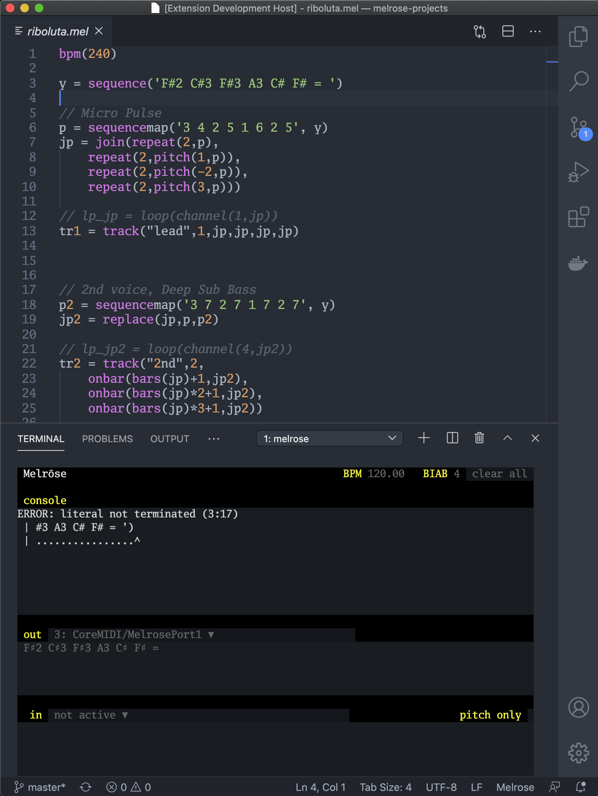
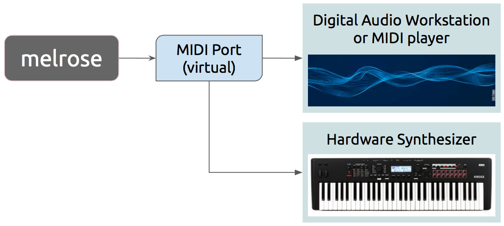

# Melrōse - programming of music melodies

## Usage

`melrōse` is a tool to create music by programming melodies and uses a custom language to compose notes that are played with MIDI.
Note sequences in your program can be changed while playing which makes it possible to even use it for live performance.
For the best experience, use the `melrōse` together with the Visual Studio Code Plugin for Melrōse.

See [documentation](https://emicklei.github.io/melrose/) how to install and use `melrōse`.

### Status

Until `v1.0.0` the language syntax may change in an incompatible way.

### Programming music

### System setup

### Install

In order to build and work with `melrose` on your operating system, the following components need to be installed:

- portmidi library
- melrose executable program
- (optionally) Melrōse plugin for Visual Studio Code

Depending on your operating system, different steps are required.

#### Mac OSX

Either use a packaged version from [Downloads](https://emicklei.github.io/melrose/garageband.html) or proceed building it from source.

    brew install portmidi

See [Brew](https://brew.sh/) for instructions on how to install `brew` on your Mac.

See the [PortMidi](https://sourceforge.net/p/portmedia/wiki/portmidi/) for alternative installation instructions of `portmidi`.

You need to install the [Go SDK](https://golang.org/dl/) for compiling the program on your machine.

	go install github.com/emicklei/melrose/cmd/melrose

After installing both `portmidi` and `melrōse`, you can start the tool in a Terminal using:

	$ melrose

If this command cannot be found then you need to add `$GOPATH/bin` to your `PATH`.

#### Linux

On Ubuntu / Debian

	apt-get install libportmidi-dev

You need to install the [Go SDK](https://golang.org/dl/) for compiling the program on your machine.

	go install github.com/emicklei/melrose/cmd/melrose

After installing both `portmidi` and `melrōse`, you can start the tool in a Terminal using:

	$ melrose

If this command cannot be found then you need to add `$GOPATH/bin` to your `PATH`.

#### Windows

Follow the instructions for installing `portmidi` as documented by [Zack](https://schollz.com/blog/portmidi/).
Then compile the program on your machine.

	go install github.com/emicklei/melrose/cmd/melrose

After installing both `portmidi` and `melrōse`, you can start the tool in a Terminal using:

	$ melrose

#### Melrōse plugin for Visual Studio Code

Search and install the extension from the editor or go to the [Marketplace published package](https://marketplace.visualstudio.com/items?itemName=EMicklei.melrose-for-vscode)

### Contributions

Fixes, suggestions, documentation improvements are all welcome.
Fork this project and submit small Pull requests. 
Discuss larger ones in the Issues list.
You can also sponsor Melrōse via [Github Sponsors](https://github.com/sponsors/emicklei).

Software is licensed under [MIT](LICENSE).
&copy; 2014-2020 [ernestmicklei.com](http://ernestmicklei.com)
