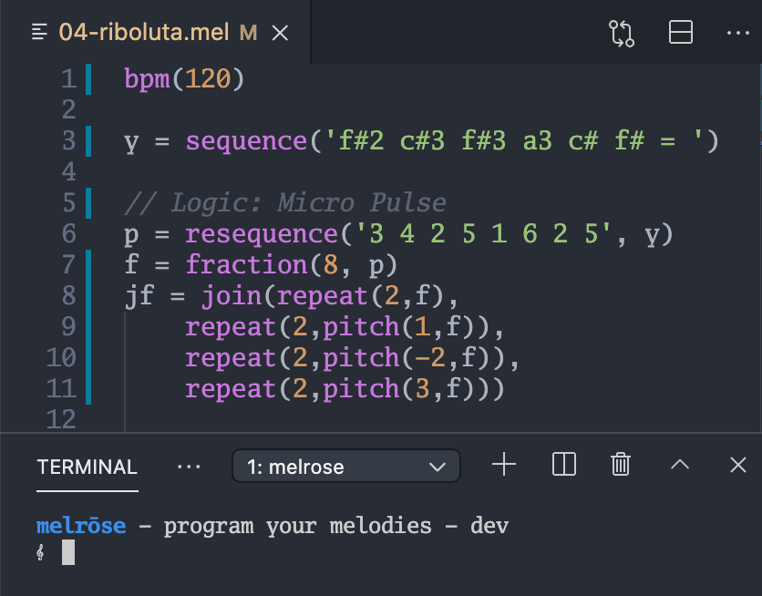
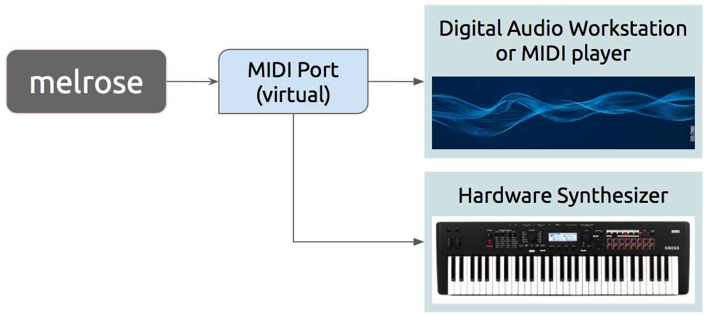

# Melrōse - programming of music melodies

[](https://github.com/emicklei/melrose/actions)
[](https://pkg.go.dev/github.com/emicklei/melrose?tab=doc)


## Introduction

`melrōse` is a tool to create and play music by programming melodies.
It uses a custom language to compose notes and create loops and tracks to play.
This is an example of a simple major scale C.

```javascript
sequence('c d e f g a b c5') // or use the alias "seq"
```

Note sequences in your program can be changed while playing giving you direct audible feedback. 
For the best experience, use the `melrōse` tool together with the Visual Studio Code Plugin for Melrōse.

See also [Blog post](http://ernestmicklei.com/melrose/introduction_melrose/)

Read the [documentation](https://melrōse.org/) on how to use `melrōse`.

## Web

See [Melrōse Playground](https://play.melrōse.org) to start writing programs directly in the browser and connect to a local running MIDI receiver, e.g. Apple Garageband.

## Install

To have a full experience of the tool in which you can work with multiple devices and files, you can install it locally on our machine. It runs in any terminal and serves both a REPL (read evaluate play loop) and a minimal Web UI. 
See [Build instructions](docs/install.md).

### Programming music



### System setup

The `melrōse` tool can connect to multiple devices at the same time and for each device, you can choose any of the 16 channels to send or receive MIDI.



### Contributions

Fixes, suggestions, documentation improvements are all welcome.
Fork this project and submit small Pull requests. 
Discuss larger ones in the Issues list.
You can also sponsor Melrōse via [Github Sponsors](https://github.com/sponsors/emicklei).

### Related tools

- `melrose-mcp` is a (server) tool that uses the [MCP](https://modelcontextprotocol.io/) protocol to receive expressions to play.
See [melrose-mcp](https://github.com/emicklei/melrose-mcp) for details how to install and use it.
- `midicyles` is a tool that visualizes MIDI events using polar coordinates (notes move around in circles).See [midicyles](https://codeberg.org/emicklei/midicycles) for details how to install and use it.
- `keymidi` is a tool that provides an interactive OS Keyboard to send MIDI events. This can be used to control the playing of music in `melrōse`.See [keymidi](https://codeberg.org/emicklei/keymidi) for details how to install and use it.
- `slidermidi` is a tool that provides an interactive UI Sliders to send MIDI change event. This can be used to control the playing of music in `melrōse`.See [slidermidi](https://codeberg.org/emicklei/slidermidi) for details how to install and use it.

Software is licensed under [MIT](LICENSE).
&copy; 2026 [ernestmicklei.com](http://ernestmicklei.com)
