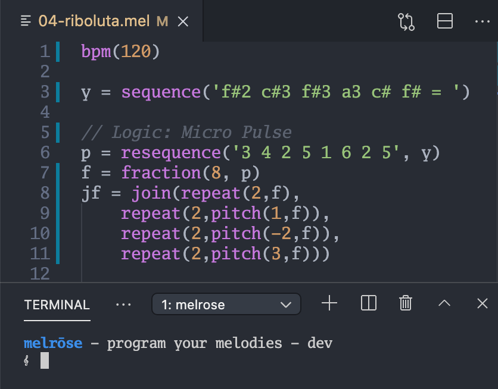
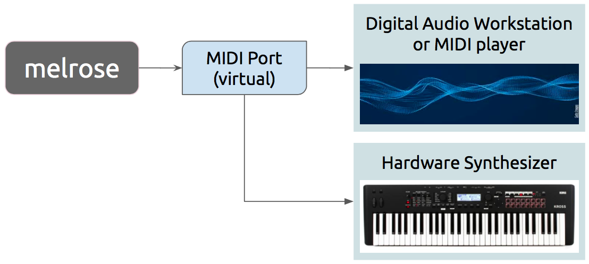

# Melrōse - programming of music melodies

[](https://github.com/emicklei/melrose/actions)
[](https://pkg.go.dev/github.com/emicklei/melrose?tab=doc)


## Introduction

`melrōse` is a tool to create and play music by programming melodies.
It uses a custom language to compose notes and create loops and tracks to play.
Write note patterns as short text expressions, then play them through a MIDI device or music app.

MIDI (Musical Instrument Digital Interface) is a digital communication language that sends musical instructions—like which note to play, how long to hold it, and how hard it is struck—between electronic instruments and computers.

This is an example of a simple major scale C.

```javascript
sequence('c d e f g a b c5') // or use the alias "seq"
```

Note sequences in your program can be changed while playing giving you direct audible feedback.

See also [Blog post](http://ernestmicklei.com/melrose/introduction_melrose/)

Read the [documentation](https://melrōse.org/) on how to use `melrōse`.

## Choose your setup

- **Try it in your browser:** Open the [Melrōse Playground](https://play.melrōse.org), enter the scale example above, connect a MIDI receiver such as GarageBand, and use the play control.
- **Work locally with music files and MIDI devices:** [Install Melrōse](docs/install.md) to use its terminal REPL and minimal Web UI. A local installation can connect to multiple devices, with up to 16 MIDI channels available per device.
- **Compose in Visual Studio Code:** Install the [Melrōse VS Code extension](https://marketplace.visualstudio.com/items?itemName=EMicklei.melrose-for-vscode) to manage music files and play music from the editor.

### Showcase



### MIDI setup



### Contributions

Fixes, suggestions, documentation improvements are all welcome.
Fork this project and submit small Pull requests. 
Discuss larger ones in the Issues list.
You can also sponsor Melrōse via [Github Sponsors](https://github.com/sponsors/emicklei).

### Related tools

- `melrose-mcp` is a (server) tool that uses the [MCP](https://modelcontextprotocol.io/) protocol to receive expressions to play.
See [melrose-mcp](https://github.com/emicklei/melrose-mcp) for details how to install and use it.
- `midicyles` is a tool that visualizes MIDI events using polar coordinates (notes move around in circles).See [midicyles](https://codeberg.org/emicklei/midicycles) for details how to install and use it.
- `keymidi` is a tool that provides an interactive OS Keyboard to send MIDI events. This can be used to control the playing of music in `melrōse`.See [keymidi](https://codeberg.org/emicklei/keymidi) for details how to install and use it.
- `slidermidi` is a tool that provides an interactive UI Sliders to send MIDI change event. This can be used to control the playing of music in `melrōse`.See [slidermidi](https://codeberg.org/emicklei/slidermidi) for details how to install and use it.

Software is licensed under [MIT](LICENSE).

&copy; 2026 [ernestmicklei.com](http://ernestmicklei.com)
