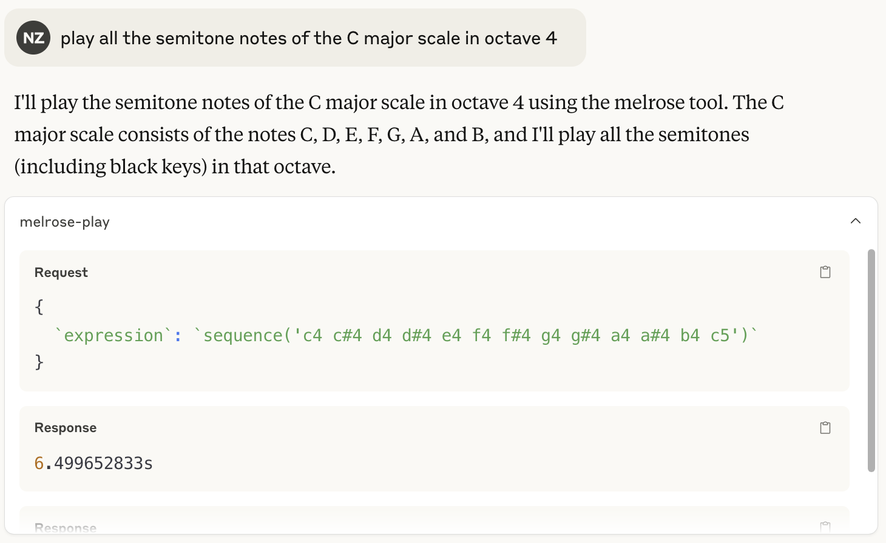
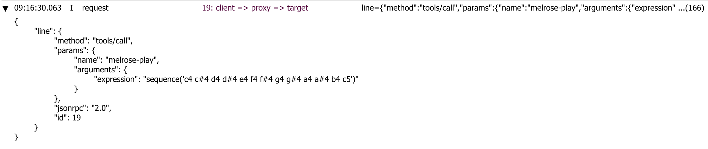
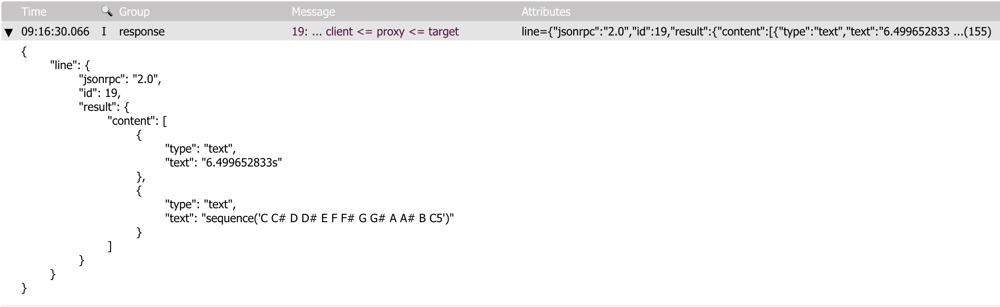

## installation

This mcp server requires the [Go SDK](https://go.dev).

    go install github.com/emicklei/melrose/cmd/melrose-mcp@latest

Under the hood MCP communication using [mcp-log-proxy](https://github.com/emicklei/mcp-log-proxy)

## configuration

### Claude

    {
        "mcpServers": { 
            ...
            "melrōse": {
            "command": "<YOUR DIRECTORY TO THE BINARY>/melrose-mcp",
            "args": []
            }
        }
    }

## example prompts

- play the music sequence  C D E
- play the first bar of fur elise
- play the famous tune from Mike Oldfield called Tubular Bells
- play the notes of Frere Jacques
- play the C# chord