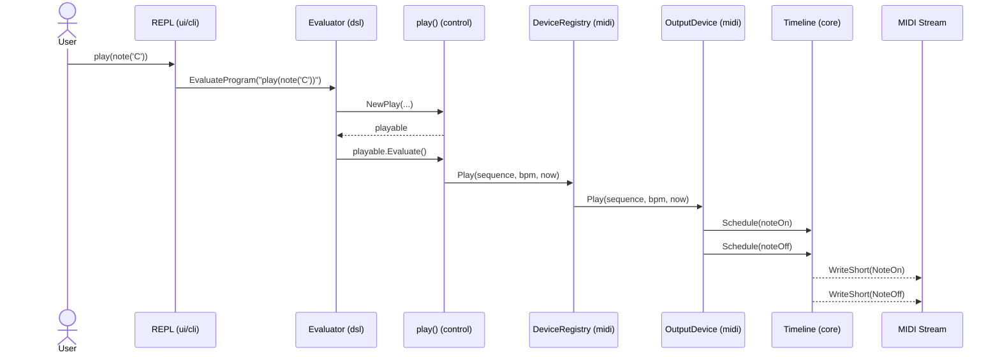

# Playing an Expression

This sequence diagram illustrates the fundamental interactions between components when playing an expression in Melrose.

```mermaid
sequenceDiagram
    actor User
    participant REPL as REPL (ui/cli)
    participant Evaluator as Evaluator (dsl)
    participant Play as play() (control)
    participant Device as DeviceRegistry (midi)
    participant Output as OutputDevice (midi)
    participant Timeline as Timeline (core)
    participant MIDI as MIDI Stream

    User->>REPL: play(note('C'))
    REPL->>Evaluator: EvaluateProgram("play(note('C'))")
    Evaluator->>Play: NewPlay(...)
    Play-->>Evaluator: playable
    Evaluator->>Play: playable.Evaluate()
    Play->>Device: Play(sequence, bpm, now)
    Device->>Output: Play(sequence, bpm, now)
    Output->>Timeline: Schedule(noteOn)
    Output->>Timeline: Schedule(noteOff)
    Timeline-->>MIDI: WriteShort(NoteOn)
    Timeline-->>MIDI: WriteShort(NoteOff)
```
